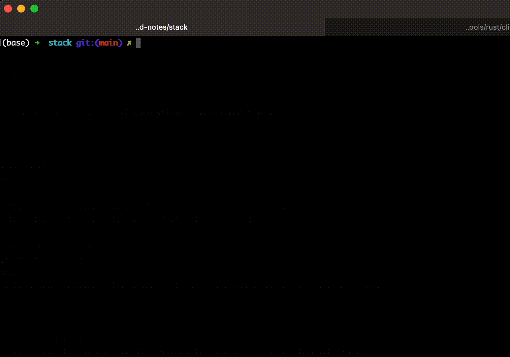

# AICommit

AICommit is a powerful tool that leverages AI to generate commit messages tailored to your style, based on your past commits. Powered by [Ollama](https://ollama.com), this simple script streamlines your workflow and ensures consistency in your commit messages.

## Features

- AI-generated commit messages based on staged changes
- Learns from your previous commit messages for style consistency
- Interactive mode allowing you to accept, edit, or reject suggested messages
- Option to view the full prompt sent to the AI model

## Prerequisites

Before you begin, ensure you have the following installed:

1. [Git](https://git-scm.com) – For version control
2. [Ollama](https://ollama.com) – Powers the AI for generating messages

## Installation

1. Download the `aicommit` script `curl -sL https://raw.githubusercontent.com/acrosa/aicommits/refs/heads/main/aicommit -o ~/Downloads/aicommit`
2. Make it executable and move it to a directory in your PATH:
```bash
chmod +x ~/Downloads/aicommit
sudo mv ~/Downloads/aicommit /usr/local/bin/aicommit
```

## Demo
Here's a video of the tool in action:




## Why Use AICommit?

- **Time-Saving:** Quickly generate well-crafted commit messages
- **Consistency:** Aligns with your existing commit message style
- **Personalized:** Learns from your previous messages to match your conventions
- **Flexible:** Allows for easy editing of suggested messages

## Contributing

Contributions are welcome! Please feel free to submit a Pull Request.

## License

[MIT License](LICENSE)

## Acknowledgements

- [Ollama](https://ollama.com) for providing the AI model